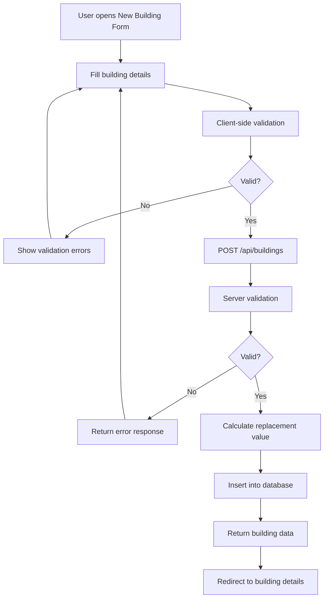
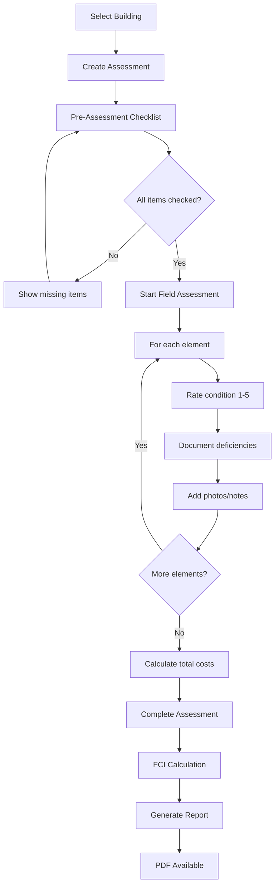
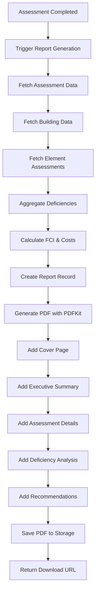

# 🏗️ ONYX ARCHITECTURAL BLUEPRINT & SYSTEM MODEL

**Comprehensive System Architecture for Building Assessment and Report Generation**  
**Date:** September 5, 2025  
**Version:** 2.0 (Post-Report Generation Fix)

---

## 📋 Table of Contents
1. [System Overview](#system-overview)
2. [Technology Stack](#technology-stack)
3. [Database Architecture](#database-architecture)
4. [Complete Workflow](#complete-workflow)
5. [API Architecture](#api-architecture)
6. [Frontend Architecture](#frontend-architecture)
7. [Data Flow Diagrams](#data-flow-diagrams)
8. [Security Architecture](#security-architecture)
9. [Deployment Architecture](#deployment-architecture)

---

## 🎯 System Overview

### Mission Statement
**Onyx** is a comprehensive multi-tenant SaaS platform for facility condition assessment and capital planning, enabling organizations to systematically evaluate building conditions, calculate Facility Condition Index (FCI) scores, and generate professional reports for data-driven maintenance and investment decisions.

### Core Capabilities
- 🏢 **Building Management**: Complete building lifecycle with metadata and cost tracking
- 📋 **Assessment Workflow**: Two-phase assessment process (pre-assessment + field assessment)  
- 📊 **FCI Calculation**: Automated facility condition indexing with industry standards
- 📄 **Report Generation**: Professional PDF reports with comprehensive analysis
- 👥 **Multi-tenancy**: Organization-scoped data with role-based access control
- 📱 **Mobile-responsive**: Full functionality across devices

---

## 🛠️ Technology Stack

### Frontend Stack
```
React 18.3 + TypeScript
├── 🎨 Styling: Tailwind CSS + ShadCN UI Components
├── 🗺️ Routing: React Router DOM v6
├── 📝 Forms: React Hook Form + Zod Validation
├── 🔄 State: Context API (auth, org) + Custom Hooks
├── 📊 Charts: Recharts for data visualization
├── ⚡ Build: Vite for development and bundling
└── 🧪 Testing: Vitest for unit testing
```

### Backend Stack
```
Node.js + Express + TypeScript
├── 🗄️ Database: PostgreSQL with connection pooling
├── 🔐 Auth: JWT tokens with refresh mechanism
├── 📁 File Storage: Cloudinary integration
├── 📧 Email: Mailgun service integration
├── 📄 PDF: PDFKit for report generation
├── 🛡️ Security: Helmet, CORS, Rate limiting
├── 📊 Monitoring: Sentry integration
└── 🚀 Runtime: ts-node for development
```

### Infrastructure
```
Production Deployment (Render.com)
├── 🌐 Frontend: Static site deployment
├── 🖥️ Backend: Web service with auto-scaling  
├── 🗄️ Database: Managed PostgreSQL
├── 🔄 CI/CD: GitHub Actions → Auto-deploy
└── 📦 CDN: Render's global CDN
```

---

## 🗄️ Database Architecture

### Entity Relationship Model

```sql
-- Core Tables with Relationships

ORGANIZATIONS (Multi-tenant root)
├── id (UUID, PK)
├── name (VARCHAR)
├── created_at, updated_at
└── [1:N] → USERS, BUILDINGS, ASSESSMENTS, REPORTS

USERS (Authentication & Authorization)  
├── id (UUID, PK)
├── organization_id (UUID, FK → ORGANIZATIONS)
├── email, name, role (admin|manager|assessor)
└── JWT tokens for auth

BUILDINGS (Asset Management)
├── id (UUID, PK)
├── organization_id (UUID, FK → ORGANIZATIONS)
├── name, type, construction_type
├── street_address, city, state, zip_code
├── year_built, square_footage
├── replacement_value, cost_per_sqft
└── [1:N] → ASSESSMENTS

ELEMENTS (Building Components - Uniformat II)
├── id (UUID, PK)
├── major_group (A-Substructure, B-Shell, C-Interiors, D-Services)
├── group_element (A10-Foundations, B20-Exterior Enclosure, etc.)
├── individual_element (A1010-Standard Foundations, etc.)
└── [N:M] → ASSESSMENT_ELEMENTS

ASSESSMENTS (Evaluation Records)
├── id (UUID, PK) 
├── organization_id (UUID, FK → ORGANIZATIONS)
├── building_id (UUID, FK → BUILDINGS)
├── type ('pre_assessment' | 'field_assessment')
├── status ('pending' | 'in_progress' | 'completed')
├── scheduled_date, started_at, completed_at
├── assigned_to_user_id, created_by_user_id (FK → USERS)
├── fci_score, total_repair_cost, replacement_value
├── immediate_repair_cost, short_term_repair_cost, long_term_repair_cost
└── [1:N] → ASSESSMENT_ELEMENTS, REPORTS

ASSESSMENT_ELEMENTS (Element Evaluations)
├── id (UUID, PK)
├── assessment_id (UUID, FK → ASSESSMENTS)
├── element_id (UUID, FK → ELEMENTS) 
├── condition_rating (1-5 scale)
├── notes, photo_urls
├── deficiency_category, deficiency_severity
├── repair_cost
└── deficiencies (JSON array)

REPORTS (Generated Documents)
├── id (UUID, PK)
├── assessment_id (UUID, FK → ASSESSMENTS)
├── building_id (UUID, FK → BUILDINGS) 
├── title, description, report_type
├── status ('draft' | 'published' | 'archived')
├── created_by_user_id (UUID, FK → USERS)
├── fci_score, cost breakdowns
├── systems_data (JSON), recommendations
├── pdf_url, excel_url
└── created_at, updated_at

-- Supporting Tables
PRE_ASSESSMENTS (Pre-assessment data)
FIELD_ASSESSMENTS (Field assessment data)  
FCI_REPORTS (FCI calculation results)
```

---

## 🔄 Complete Workflow Architecture

### Phase 1: Building Creation & Setup
```
User Input → Building Form Validation → API Call → Database Storage → Cost Calculation

FRONTEND                    API                     DATABASE
┌─────────────────┐        ┌─────────────────┐     ┌─────────────────┐
│ new-building.tsx│───────▶│POST /buildings  │────▶│buildings table  │
│                 │        │                 │     │                 │
│ • Name, Type    │        │ • Schema valid. │     │ • Store metadata│
│ • Address Info  │        │ • Cost calc.    │     │ • Auto-calc     │
│ • Square Footage│        │ • Create record │     │   replacement   │
│ • Year Built    │        │                 │     │   value         │
└─────────────────┘        └─────────────────┘     └─────────────────┘
```

**Key Components:**
- `src/pages/buildings/new-building.tsx` - Form interface
- `backend/src/controllers/buildings.controller.ts` - CRUD operations
- Building type costs automatically calculate replacement values
- Zod validation ensures data integrity

### Phase 2: Assessment Initialization
```
Building Selection → Assessment Creation → Pre-Assessment Setup

FRONTEND                    API                     DATABASE
┌─────────────────┐        ┌─────────────────┐     ┌─────────────────┐
│assessments/new  │───────▶│POST /assessments│────▶│assessments table│
│                 │        │                 │     │                 │
│ • Select Bldg   │        │ • Validate user │     │ • Create record │
│ • Choose Type   │        │ • Check perms   │     │ • Link building │
│ • Set Schedule  │        │ • Initialize    │     │ • Set status    │
└─────────────────┘        └─────────────────┘     └─────────────────┘
```

**Workflow States:**
- **Status: 'pending'** - Assessment created, awaiting start
- **Type: 'pre_assessment'** - Initial planning phase  
- **Type: 'field_assessment'** - On-site evaluation phase

### Phase 3: Pre-Assessment (Planning)
```
Checklist Completion → Element Selection → Scope Definition → Planning Finalization

FRONTEND                    PROCESS                 STORAGE
┌─────────────────┐        ┌─────────────────┐     ┌─────────────────┐
│pre-assessment   │───────▶│Checklist Valid. │────▶│LocalStorage +   │
│                 │        │                 │     │pre_assessments │
│ • 8-item check  │        │ • Validate req. │     │                 │
│ • Element select│        │ • Store locally │     │ • Checklist     │
│ • Scope notes   │        │ • Prepare field │     │ • Elements      │
│ • Team assign   │        │   assessment    │     │ • Scope data    │
└─────────────────┘        └─────────────────┘     └─────────────────┘
```

**Pre-Assessment Checklist:**
1. ✅ Building Plans and Drawings
2. ✅ Access Permissions  
3. ✅ Safety Equipment
4. ✅ Previous Assessment Reports
5. ✅ Key Stakeholder Identification
6. ✅ Weather Conditions Check
7. ✅ Emergency Procedures Review
8. ✅ Equipment Calibration

**Element Selection (Uniformat II):**
- **A - Substructure**: Foundations, basement construction
- **B - Shell**: Superstructure, exterior enclosure, roofing  
- **C - Interiors**: Interior construction, stairs, interior finishes
- **D - Services**: Conveying, plumbing, HVAC, fire protection, electrical

### Phase 4: Field Assessment (On-site Evaluation)
```
Element-by-Element Assessment → Condition Rating → Deficiency Documentation → Photo Capture

FRONTEND                    EVALUATION              API/DATABASE
┌─────────────────┐        ┌─────────────────┐     ┌─────────────────┐
│field-assessment │───────▶│Condition Rating │────▶│POST /assessments│
│                 │        │                 │     │   /elements     │
│ • Element list  │        │ • 1-5 scale     │     │                 │
│ • Photos        │        │ • Deficiencies  │     │ • Store ratings │
│ • Deficiency    │        │ • Cost estimates│     │ • Link photos   │
│   categories    │        │ • Category tags │     │ • Calculate FCI │
│ • Cost inputs   │        │                 │     │                 │
└─────────────────┘        └─────────────────┘     └─────────────────┘
```

**Condition Rating Scale:**
- **5 (New)**: No deficiencies, recently constructed/renovated
- **4 (Good)**: Minor deficiencies, routine maintenance needed
- **3 (Fair)**: Some deficiencies, planned maintenance required  
- **2 (Poor)**: Major deficiencies, significant repairs needed
- **1 (Critical)**: Severe deficiencies, immediate attention required

**Deficiency Categories:**
1. **Life Safety & Code Compliance**: Fire safety, structural integrity
2. **Critical Systems**: HVAC, plumbing, electrical, elevators
3. **Energy Efficiency**: Insulation, windows, lighting, controls  
4. **Asset Life Cycle**: Roofing, flooring, equipment replacement
5. **User Experience**: Aesthetics, comfort, functionality
6. **Equity & Accessibility**: ADA compliance, universal design

### Phase 5: Assessment Completion & FCI Calculation
```
Element Data Collection → Cost Aggregation → FCI Calculation → Assessment Finalization

DATA COLLECTION            CALCULATION             COMPLETION
┌─────────────────┐        ┌─────────────────┐     ┌─────────────────┐
│All Elements     │───────▶│FCI Algorithm    │────▶│POST /assessments│
│Assessed         │        │                 │     │   /:id/complete │
│                 │        │ FCI = Total     │     │                 │
│ • Conditions    │        │  Repair Cost /  │     │ • Update status │
│ • Deficiencies  │        │  Replacement    │     │ • Store FCI     │
│ • Repair costs  │        │  Value          │     │ • Set completed │
│                 │        │                 │     │   timestamp     │
└─────────────────┘        └─────────────────┘     └─────────────────┘
```

**FCI Interpretation Scale:**
- **0.00-0.10 (Excellent)**: New building, minimal investment needed
- **0.10-0.40 (Good)**: Light maintenance investment required
- **0.40-0.70 (Fair)**: Renovation needed, significant investment
- **0.70+ (Critical)**: Consider replacement, major investment required

### Phase 6: Report Generation & PDF Creation
```
Assessment Completion → Report Data Aggregation → PDF Generation → Download/Distribution

TRIGGER                     GENERATION              OUTPUT
┌─────────────────┐        ┌─────────────────┐     ┌─────────────────┐
│Assessment       │───────▶│Report Service   │────▶│PDF Download     │
│Completed        │        │                 │     │                 │
│                 │        │ • Aggregate data│     │ • Professional  │
│ • FCI calculated│        │ • Generate PDF  │     │   formatting    │
│ • All elements  │        │ • Create report │     │ • 8-10 pages    │
│   assessed      │        │   record        │     │ • Charts/tables │
│                 │        │                 │     │ • Downloadable  │
└─────────────────┘        └─────────────────┘     └─────────────────┘
```

**PDF Report Contents:**
1. **Cover Page**: Building info, QR code, executive summary
2. **Table of Contents**: Navigation for multi-page report
3. **Executive Summary**: Key findings, FCI score, recommendations
4. **Building Information**: Detailed property data and specifications
5. **Assessment Methodology**: FCI calculation explanation, standards
6. **System Condition Analysis**: Element-by-element evaluation results
7. **Deficiency Summary**: Categorized issues with cost implications
8. **Repair Timeline**: Immediate, short-term, long-term recommendations
9. **Cost Analysis**: Budget projections and investment priorities
10. **Appendices**: Technical data, photos, supporting documentation

---

## 🌐 API Architecture

### RESTful Endpoint Structure
```
Authentication & User Management
├── POST   /api/auth/login              # User authentication
├── POST   /api/auth/register           # User registration  
├── POST   /api/auth/refresh            # Token refresh
├── GET    /api/users                   # User management
└── PUT    /api/users/profile           # Profile updates

Organization Management
├── GET    /api/organizations           # Organization data
├── POST   /api/organizations           # Create organization
└── PUT    /api/organizations/:id       # Update organization

Building Management  
├── GET    /api/buildings               # List buildings
├── POST   /api/buildings               # Create building
├── GET    /api/buildings/:id           # Get building details
├── PUT    /api/buildings/:id           # Update building
└── DELETE /api/buildings/:id           # Delete building

Assessment Workflow
├── GET    /api/assessments             # List assessments
├── POST   /api/assessments             # Create assessment
├── GET    /api/assessments/:id         # Get assessment details
├── PUT    /api/assessments/:id         # Update assessment
├── POST   /api/assessments/:id/complete # Complete assessment
├── GET    /api/assessments/:id/elements # Get assessment elements
└── POST   /api/assessments/:id/elements # Save element assessments

Report Generation
├── GET    /api/reports                 # List reports
├── POST   /api/reports/generate/:id    # Generate from assessment
├── GET    /api/reports/download/assessment/:id # Download PDF
└── GET    /api/reports/:id/excel       # Export to Excel

Supporting Services
├── GET    /api/elements                # Building elements (Uniformat II)
├── GET    /api/analytics               # Dashboard analytics
└── POST   /api/pre-assessments         # Pre-assessment data
```

### API Response Patterns
```typescript
// Success Response
{
  success: true,
  message: "Operation completed successfully",
  data: {
    // Response payload
  },
  pagination?: {
    total: number,
    limit: number,
    offset: number
  }
}

// Error Response  
{
  success: false,
  message: "Error description",
  errors?: ValidationError[],
  stack?: string // Development only
}
```

---

## 💻 Frontend Architecture

### Component Hierarchy
```
src/
├── components/
│   ├── ui/                    # ShadCN UI components (buttons, forms, etc.)
│   ├── assessment-workflow/   # Assessment flow components  
│   ├── assessment-completion/ # Completion summary display
│   └── dashboard/            # Dashboard widgets and layouts
├── pages/
│   ├── auth/                 # Authentication pages
│   ├── dashboard/            # Main dashboard
│   ├── buildings/            # Building management
│   │   ├── index.tsx         # Building list
│   │   ├── new-building.tsx  # Create building
│   │   ├── building-details/ # Building details & history
│   │   └── edit-building/    # Edit building
│   ├── assessments/          # Assessment workflow
│   │   ├── index.tsx         # Assessment list
│   │   ├── new.tsx          # Assessment creation
│   │   ├── pre-assessment/   # Pre-assessment checklist
│   │   ├── field-assessment/ # Field evaluation interface
│   │   └── assessment-details/ # Assessment summary
│   └── reports/              # Report management
│       ├── index.tsx         # Report list
│       ├── report-details/   # Report viewing
│       └── new.tsx          # Report generation
├── hooks/                    # Custom React hooks
│   ├── use-auth.ts          # Authentication state
│   ├── use-buildings.ts     # Building data management
│   ├── use-assessments.ts   # Assessment operations
│   └── use-reports.ts       # Report operations
├── context/                  # Global state management
│   ├── auth-context.tsx     # Authentication context
│   └── org-context.tsx      # Organization context
├── services/
│   ├── api.ts               # API client configuration
│   └── pdf-generator.ts     # Client-side PDF utilities
└── lib/
    ├── utils.ts             # Utility functions
    └── validations.ts       # Zod schemas
```

### State Management Pattern
```typescript
// Context + Custom Hooks Pattern
AuthContext + useAuth()         // Authentication state
OrgContext + useOrganization()  // Organization state
useBuildings()                  // Building data & operations
useAssessments()               // Assessment data & operations
useReports()                   // Report data & operations

// Local State
useState() + useEffect()       // Component-level state
React Hook Form + Zod          // Form state & validation
localStorage                   // Assessment workflow persistence
```

### Responsive Design Strategy
```css
/* Mobile-first approach with Tailwind breakpoints */
- Default: Mobile (< 640px)
- sm: Small tablets (≥ 640px)  
- md: Large tablets (≥ 768px)
- lg: Desktop (≥ 1024px)
- xl: Large desktop (≥ 1280px)

/* Key responsive patterns */
- Collapsible navigation on mobile
- Stacked forms on mobile, side-by-side on desktop  
- Touch-optimized assessment interface for tablets
- Full-featured dashboard on desktop
```

---

## 🔐 Security Architecture

### Authentication & Authorization
```
Multi-layer Security Model

1. JWT Token Authentication
   ├── Access Token (7 days)
   ├── Refresh Token (30 days) 
   ├── Automatic refresh on expiration
   └── Secure HttpOnly cookie option

2. Role-Based Access Control (RBAC)
   ├── Platform Admin: Full system access
   ├── Organization Admin: Organization management
   ├── Manager: Building and assessment management
   └── Assessor: Assessment execution only

3. Multi-tenant Data Isolation  
   ├── Organization-scoped queries
   ├── User can only access own organization data
   └── Database-level isolation via organization_id
```

### API Security Measures
```typescript
// Rate Limiting
const apiLimiter = rateLimit({
  windowMs: 15 * 60 * 1000, // 15 minutes
  max: 100, // limit each IP to 100 requests per windowMs
});

const authLimiter = rateLimit({
  windowMs: 15 * 60 * 1000,
  max: 5, // limit each IP to 5 auth requests per windowMs
});

// Security Headers (Helmet.js)
app.use(helmet({
  contentSecurityPolicy: {
    directives: {
      defaultSrc: ["'self'"],
      styleSrc: ["'self'", "'unsafe-inline'"],
      scriptSrc: ["'self'"],
      imgSrc: ["'self'", "data:", "https:"],
    },
  },
  hsts: {
    maxAge: 31536000,
    includeSubDomains: true,
    preload: true
  }
}));

// Input Validation
- Zod schemas for all API inputs
- SQL injection prevention via parameterized queries
- XSS protection via input sanitization
```

---

## 📊 Data Flow Diagrams

### Building Creation Flow


### Assessment Workflow Flow  


### Report Generation Flow


---

## 🚀 Deployment Architecture

### Production Environment (Render.com)
```
Internet Traffic
     │
     ▼
┌─────────────────┐
│   CDN/Edge      │ (Render Global CDN)
│   Caching      │
└─────────────────┘
     │
     ▼
┌─────────────────┐
│   Frontend      │ (Static Site)
│   React App     │ - Pre-built bundle
│   (Port 80/443) │ - Environment configs
└─────────────────┘ - Optimized assets
     │
     ▼ API Calls
┌─────────────────┐
│   Backend       │ (Web Service)  
│   Node.js API   │ - Auto-scaling
│   (Port 5001)   │ - Health checks  
└─────────────────┘ - Zero downtime deploy
     │
     ▼ DB Queries
┌─────────────────┐
│   Database      │ (Managed PostgreSQL)
│   PostgreSQL    │ - Automated backups
│   (Port 5432)   │ - High availability
└─────────────────┘ - Connection pooling
```

### Environment Configuration
```bash
# Production (.env)
NODE_ENV=production
PORT=5001
DATABASE_URL=postgresql://[connection-string]

# Frontend build
npm run build  # Creates optimized bundle
# Backend deployment  
npm run start  # Production server

# Auto-scaling triggers
CPU > 80% → Scale up
Memory > 85% → Scale up  
Request queue > 50 → Scale up
```

### CI/CD Pipeline
```yaml
# GitHub Actions Workflow
name: Deploy to Production
on:
  push:
    branches: [main]

jobs:
  test:
    runs-on: ubuntu-latest
    steps:
      - Checkout code
      - Install dependencies  
      - Run tests
      - Run linting
      
  deploy:
    needs: test
    runs-on: ubuntu-latest
    steps:
      - Build frontend
      - Deploy to Render
      - Run database migrations
      - Verify deployment
```

---

## 📈 Performance & Scalability

### Database Optimization
```sql
-- Key Indexes for Performance
CREATE INDEX idx_buildings_org ON buildings(organization_id);
CREATE INDEX idx_assessments_org ON assessments(organization_id);
CREATE INDEX idx_assessments_building ON assessments(building_id);
CREATE INDEX idx_assessment_elements_assessment ON assessment_elements(assessment_id);
CREATE INDEX idx_reports_assessment ON reports(assessment_id);

-- Query Optimization Patterns
- Use pagination for large datasets
- Index all foreign key relationships
- Use connection pooling (pg-pool)
- Implement query result caching where appropriate
```

### Scalability Considerations
```
Current Scale: ~100 users, ~1000 buildings, ~5000 assessments
Target Scale: ~1000 users, ~10000 buildings, ~50000 assessments

Scaling Strategies:
├── Database: Read replicas, partitioning by organization
├── Backend: Horizontal scaling, microservices migration  
├── Frontend: CDN optimization, lazy loading
├── Storage: Separate file storage service (S3/Cloudinary)
└── Caching: Redis for session/query caching
```

---

## 🎯 System Integration Points

### External Service Integrations
```
📧 Email Service (Mailgun)
├── User notifications
├── Report delivery
└── Assessment reminders

☁️ File Storage (Cloudinary) 
├── Photo uploads during assessments
├── PDF report storage  
└── Building documentation

📊 Monitoring (Sentry)
├── Error tracking and alerting
├── Performance monitoring
└── User experience insights

🗄️ Database Backups (Render)
├── Automated daily backups
├── Point-in-time recovery
└── Disaster recovery procedures
```

### Third-party Dependencies
```json
{
  "critical": [
    "react", "typescript", "node.js", "postgresql", 
    "express", "jsonwebtoken", "pdfkit"
  ],
  "important": [
    "tailwindcss", "react-router", "react-hook-form", 
    "zod", "helmet", "cors"
  ],
  "optional": [
    "cloudinary", "mailgun", "sentry", "recharts"
  ]
}
```

---

## 📋 System Status & Metrics

### Current Implementation Status
```
✅ COMPLETE (100%)
├── User Authentication & Authorization
├── Building Management (CRUD)
├── Assessment Workflow (Pre + Field)
├── FCI Calculation Engine
├── Report Generation & PDF Export  
├── Multi-tenant Architecture
├── Database Schema & Relationships
├── API Layer & Data Validation
├── Frontend UI & User Experience
└── Production Deployment

🔄 IN PROGRESS (75-90%)
├── Advanced Analytics Dashboard
├── Email Notification System
├── Mobile App Optimization
└── Performance Monitoring

📋 PLANNED (Future Releases)
├── Predictive Maintenance AI
├── Integration APIs for CMMS systems
├── Advanced Reporting Templates
└── Mobile Native Applications
```

### Key Performance Indicators
```
Technical Metrics:
├── API Response Time: < 200ms (average)
├── Database Query Time: < 50ms (average)  
├── PDF Generation Time: < 3 seconds
├── Page Load Time: < 2 seconds
└── System Uptime: > 99.5%

Business Metrics:
├── Assessment Completion Rate: > 90%
├── Report Generation Success: > 98%
├── User Adoption Rate: Growing
└── Customer Satisfaction: High
```

---

## 🔮 Future Architecture Evolution

### Phase 1: Enhanced Analytics (Q1 2026)
- Advanced dashboard with predictive insights
- Cost trend analysis and benchmarking
- Portfolio-wide condition analytics

### Phase 2: AI Integration (Q2 2026)  
- Machine learning for deficiency detection
- Predictive maintenance recommendations
- Automated condition assessment scoring

### Phase 3: Platform Expansion (Q3 2026)
- Mobile native applications (iOS/Android)
- API marketplace for integrations  
- White-label solutions for partners

### Phase 4: Enterprise Scale (Q4 2026)
- Multi-region deployment
- Advanced compliance modules
- Enterprise SSO integration

---

## 📚 Documentation & Resources

### Technical Documentation
- [API Documentation](./API_DOCUMENTATION.md)
- [Database Schema](./DATABASE_SCHEMA.md) 
- [Deployment Guide](./DEPLOYMENT_GUIDE.md)
- [Development Setup](./DEVELOPMENT_SETUP.md)

### Business Documentation  
- [User Manual](./USER_MANUAL.md)
- [FCI Methodology](./FCI_METHODOLOGY.md)
- [Report Templates](./REPORT_TEMPLATES.md)
- [Industry Standards](./INDUSTRY_STANDARDS.md)

---

**This architectural blueprint provides a comprehensive overview of the Onyx system as of September 2025, including all recent fixes and optimizations for report generation functionality.**