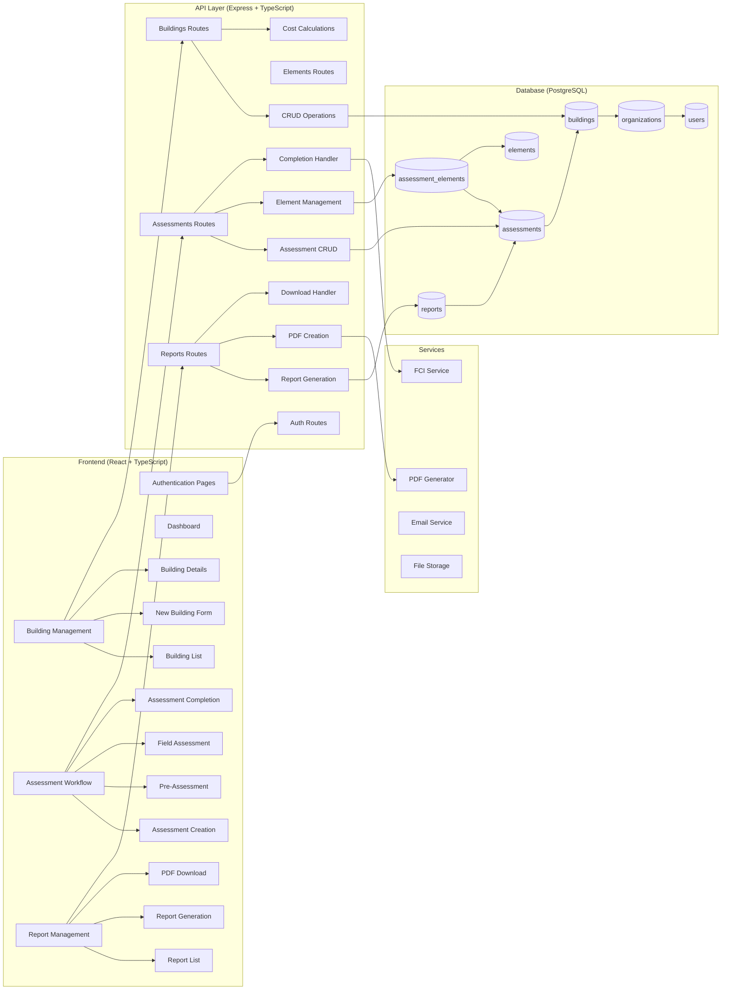
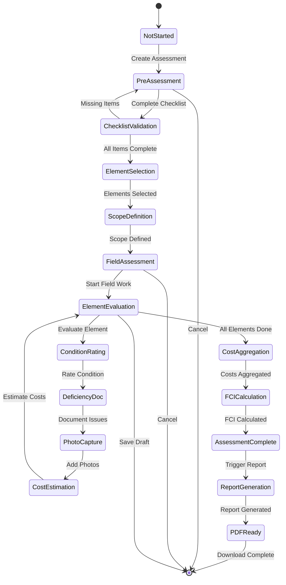
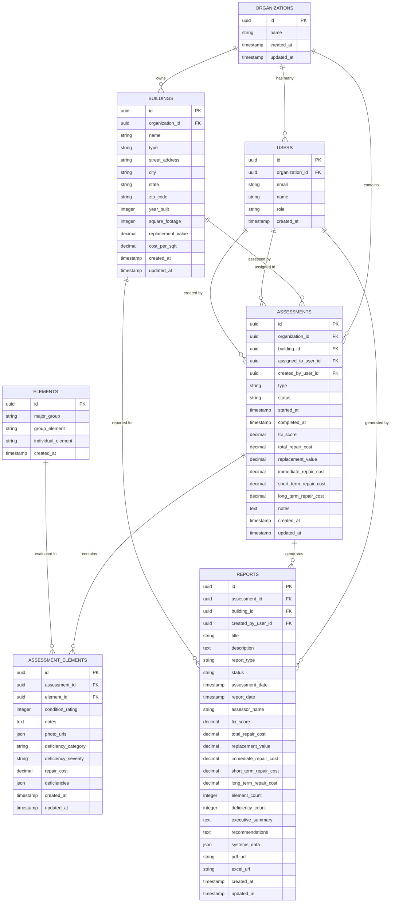
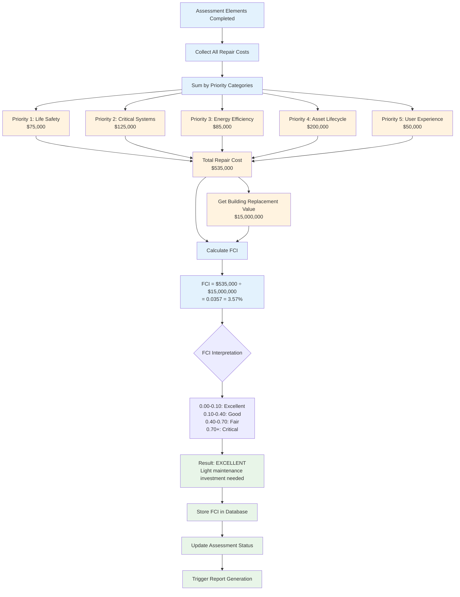
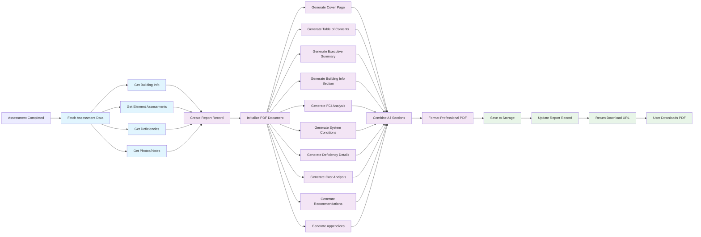
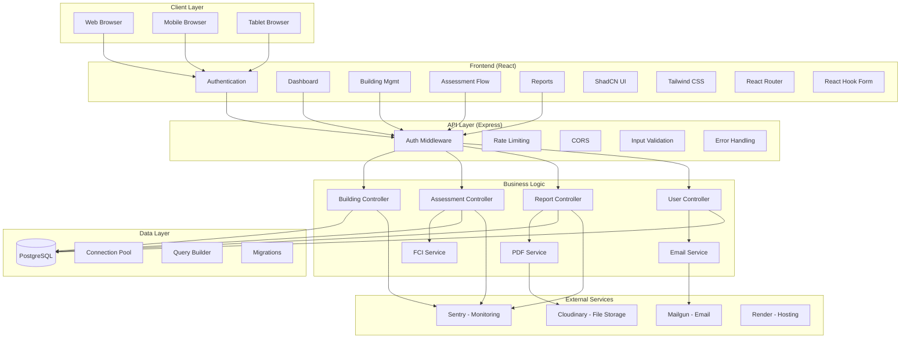

# 🔄 ONYX COMPLETE WORKFLOW DIAGRAM

**Visual representation of the complete building assessment workflow from creation to report generation**

## 📊 Complete System Flow

```mermaid
graph TB
    %% User Authentication
    A[User Login] --> B{Authenticated?}
    B -->|No| C[Login Form]
    C --> D[JWT Token Generated]
    D --> E[Dashboard Access]
    B -->|Yes| E
    
    %% Building Management Phase
    E --> F[Buildings Management]
    F --> G{Building Exists?}
    G -->|No| H[Create New Building]
    G -->|Yes| I[Select Existing Building]
    
    %% Building Creation Detail
    H --> H1[Building Form]
    H1 --> H2[Validation & Cost Calculation]
    H2 --> H3[Save to Database]
    H3 --> I
    
    %% Assessment Creation Phase
    I --> J[Start New Assessment]
    J --> K[Assessment Type Selection]
    K --> L[Pre-Assessment Phase]
    
    %% Pre-Assessment Detail
    L --> L1[Pre-Assessment Checklist]
    L1 --> L2[Element Selection]
    L2 --> L3[Scope Definition]
    L3 --> M{Checklist Complete?}
    M -->|No| L1
    M -->|Yes| N[Field Assessment Phase]
    
    %% Field Assessment Detail
    N --> N1[Element Evaluation Loop]
    N1 --> N2[Condition Rating 1-5]
    N2 --> N3[Deficiency Documentation]
    N3 --> N4[Photo Capture]
    N4 --> N5[Cost Estimation]
    N5 --> N6{More Elements?}
    N6 -->|Yes| N1
    N6 -->|No| O[Assessment Completion]
    
    %% Completion & Calculation
    O --> O1[Aggregate All Costs]
    O1 --> O2[Calculate FCI Score]
    O2 --> O3[Update Assessment Status]
    O3 --> P[Report Generation Trigger]
    
    %% Report Generation Detail
    P --> P1[Fetch Assessment Data]
    P1 --> P2[Fetch Building Data]
    P2 --> P3[Generate Report Record]
    P3 --> P4[Create PDF with PDFKit]
    P4 --> P5[Format Professional Report]
    P5 --> Q[PDF Ready for Download]
    
    %% Final Actions
    Q --> R[User Downloads Report]
    R --> S[Capital Planning Decisions]
    
    %% Styling
    classDef userAction fill:#e1f5fe
    classDef systemProcess fill:#f3e5f5
    classDef database fill:#e8f5e8
    classDef decision fill:#fff3e0
    
    class A,C,H1,L1,N2,N3,N4,R userAction
    class D,H2,L2,L3,N1,N5,O1,O2,P1,P2,P4,P5 systemProcess
    class H3,O3,P3 database
    class B,G,M,N6 decision
```

## 🏗️ Detailed Component Architecture

## 🔄 Assessment Workflow State Machine

## 📊 Database Entity Relationships

## 🎯 FCI Calculation Flow

## 📄 Report Generation Pipeline

## 🔧 Technology Integration Map

This comprehensive architectural blueprint and workflow diagram shows exactly how Onyx works from building creation through report generation, including all the components, data flows, and integrations that make the system function seamlessly.